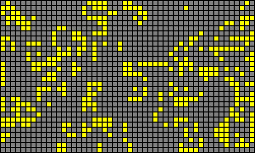

# Conways Game of Life - Widget



## General info

A configurable widget based on Web Components and Web Workers. Creates a randomly populated Conway's Game of Life based on the provided settings.

## Commands

### Run local server

```bash
webpack serve --mode development
```
### Build for development
```bash
npx webpack --mode development
```

### Build for production
```bash
npx webpack --mode production
```

## Usage info

Append the script at the bottom of the page body:

```html
<script src="path/to/script/cgol.js"></script>
```

Add the component to the template with desired settings:

```html
<cgol-widget
  cols="50"
  rows="30"
  population-percentage="50"
  generation-lifespan="200"
  cell-size="8"
  cell-spacing="2"
  bg-color="black"
  cell-color="yellow"
  dead-cell-color="gray"
  restart-interval="1000"
  font-color="yellow"
  show-stats="false"
  show-extinction-stats="true"
></cgol-widget>
```
